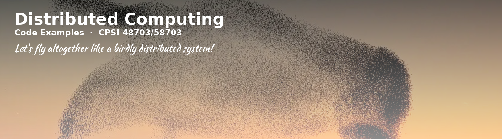

  

<h1 align="center">Distributed Computing — Code Examples</h1>

<em>CPSI 48703/58703 · University of Arkansas at Little Rock</em>

  
  

 

Code examples shared during lectures, taught by **Francesco Cavarretta**. This
repo grows over time as new examples are introduced in class.

Course material follows Andrew S. Tanenbaum and Maarten van Steen,
*Distributed Systems*, 4th ed. — see the book's companion site at
[distributed-systems.net](https://www.distributed-systems.net/index.php/books/ds4/).

---

Examples are organized by lecture in their own subdirectories, each with its
own instructions.

---

## Attribution

Code is adapted from Andrew S. Tanenbaum and Maarten van Steen, *Distributed
Systems*, 4th ed., for classroom use, and is shared here for reference
rather than under an open-source license.

Distributed Computing · Francesco Cavarretta · UA Little Rock

